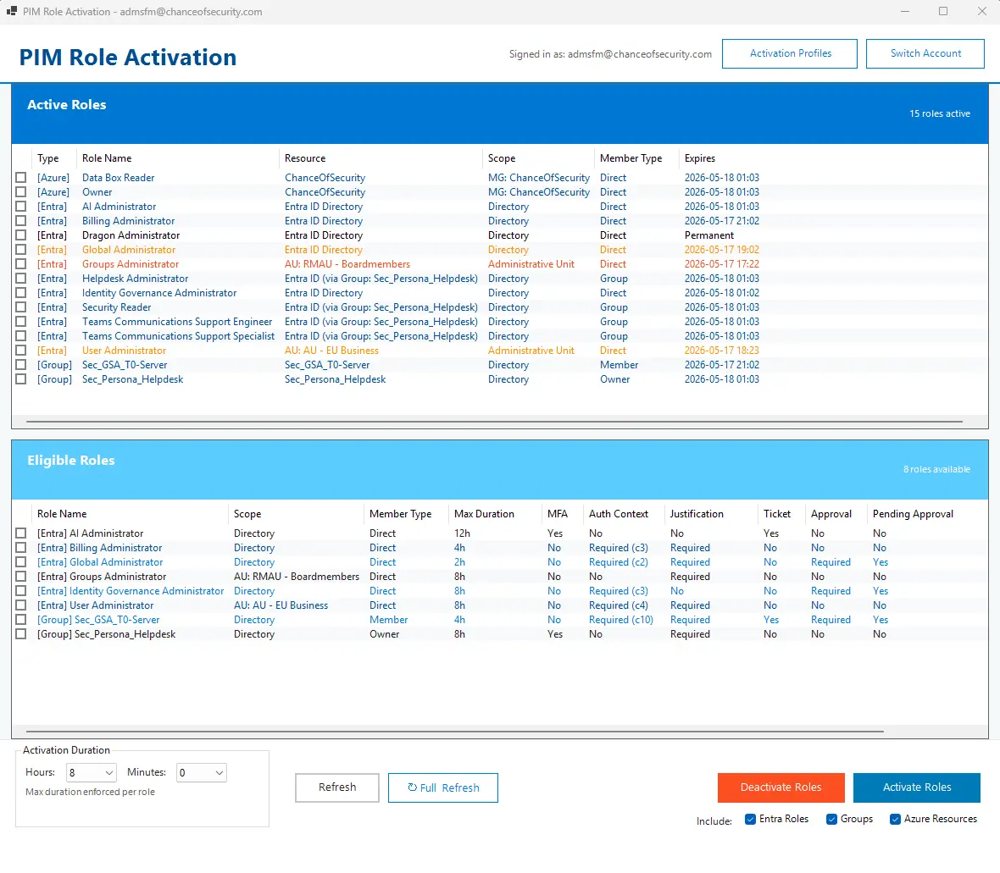
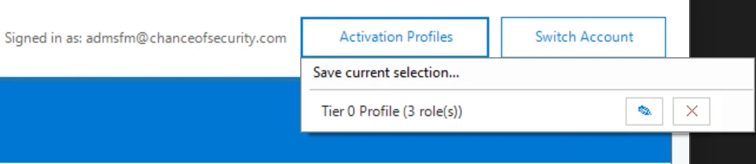
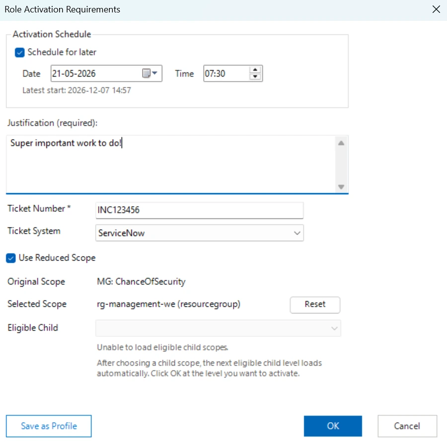

# PIMActivation PowerShell Module

[](https://www.powershellgallery.com/packages/PIMActivation)
[](https://www.powershellgallery.com/packages/PIMActivation)
[](https://github.com/Noble-Effeciency13/PIMActivation/actions/workflows/PSGalleryPublish.yml)
[](https://opensource.org/licenses/MIT)

A comprehensive PowerShell module for managing Privileged Identity Management (PIM) role activations across Microsoft Entra ID, PIM-enabled groups, and Azure Resources through an intuitive graphical interface. Streamline privileged access with bulk activation, scheduled activations, authentication-context batching, Azure reduced scope selection, reusable activation profiles, and policy-aware workflows across your Azure and Microsoft 365 environment.

> **Read the full blog post**: [PIMActivation: The Ultimate Tool for Microsoft Entra PIM Bulk Role Activation](https://www.chanceofsecurity.com/post/microsoft-entra-pim-bulk-role-activation-tool) on [Chance of Security](https://www.chanceofsecurity.com/)


## Key Features

- **Modern GUI Interface** - Clean, responsive Windows Forms application with real-time updates
- **Multi-Role Support** - Activate Microsoft Entra ID roles, PIM-enabled security groups, and Azure Resource roles
- **Parallel Processing Engine** - Fast parallel execution with real-time progress tracking and status indicators
- **High-Performance Batch API** - 85% reduction in API calls through intelligent batching, caching, and concurrent operations
- **Advanced Duplicate Role Handling** - Sophisticated MemberType-based classification system for managing roles with multiple assignment paths
- **Authentication Context Support** - Shows claim IDs like `Required (C2)` and groups shared contexts to reduce repeated prompts and metadata calls
- **Scheduled Activations** - Choose a future local date/time for activation requests within selected role eligibility windows
- **Activation Profiles** - Save, update, delete, and quickly launch frequently used role combinations from local profiles
- **Azure Reduced Scope** - Activate Azure Resource roles at a smaller effective scope using guided subscription, resource group, and resource selection
- **Persistent Policy Cache** - Tenant-scoped policy metadata cache speeds up startup while avoiding token or secret persistence
- **Flexible Duration** - Configurable activation periods from 30 minutes to 24 hours, depending on policy maximum
- **Policy Compliance** - Automatic detection and handling of MFA, justification, ticket, approval, and authentication-context requirements
- **Batch Activation Visibility** - Activation progress shows grouped role details for each batch and logs batch membership for troubleshooting
- **Adaptive Activation Splash** - Operation splash auto-resizes to fit long batch overviews and multi-line status messages
- **Inherited Role Visibility** - When a PIM group is activated, the active list also shows each role the group grants as `Entra ID (via Group: <name>)` so inherited coverage is visible immediately after activation
- **Up-to-Date Snapshot** - Shows current active and pending assignments based on the latest refresh or user action
- **Account Management** - Easy account switching without application restart
- **PowerShell Compatibility** - Requires PowerShell 7+ for optimal parallel processing performance and modern language features

## Screenshots

### Main Interface


*Main overview showing eligible roles, active assignments, activation profiles, policy requirements, authentication-context indicators, and activation controls.*

### Activation Profiles


*Activation Profiles menu and profile actions for saving, launching, updating, and deleting reusable role selections.*

### Activation Window


*Activation window with duration, scheduling, profile, reduced-scope, justification, ticket, and policy requirement options.*

## Quick Start

### Installation

#### From PowerShell Gallery (Recommended)
```powershell
# Install for current user
Install-Module -Name PIMActivation -Scope CurrentUser

# Install system-wide (requires admin)
Install-Module -Name PIMActivation -Scope AllUsers
```

#### From GitHub Source
```powershell
# Clone and import
git clone https://github.com/Noble-Effeciency13/PIMActivation.git
cd PIMActivation
Import-Module .\PIMActivation.psd1
```

### First Run
```powershell
# Launch the PIM activation interface
Start-PIMActivation
```

On first launch, you'll be prompted to authenticate with Microsoft Graph using your organizational account.

### Use a specific app registration (optional)
If your organization requires using a dedicated app registration for delegated auth, provide ClientId and TenantId:

```powershell
Start-PIMActivation -ClientId "<appId>" -TenantId "<tenantId>"
```

When both are provided, authentication uses the supplied app; otherwise, the default interactive flow is used.

## Prerequisites

### System Requirements
- **Windows Operating System** (Windows 10/11 or Windows Server 2016+)
- **PowerShell 7+** (Download from [https://aka.ms/powershell](https://aka.ms/powershell))
- **.NET Framework 4.7.2+** (for Windows Forms support)

### Required PowerShell Modules
The following modules must be installed and discoverable. Microsoft Graph and Azure modules are validated and loaded when `PIMActivation` is imported so Azure Resource role support is ready without extra module-load cost:

#### Microsoft Graph (for Entra ID and Groups)
- `Microsoft.Graph.Authentication` (2.29.0+)
- `Microsoft.Graph.Users` (2.29.0+)
- `Microsoft.Graph.Identity.DirectoryManagement` (2.29.0+)
- `Microsoft.Graph.Identity.Governance` (2.29.0+)
- `Microsoft.Graph.Groups` (2.29.0+)
- `Microsoft.Graph.Identity.SignIns` (2.29.0+)

#### Azure PowerShell (for Azure Resources)
- `Az.Accounts` (5.1.0+) - provides authentication and context management
- `Az.Resources` (6.0.0+) - required for Azure Resource PIM role management

**Note:** If dependency validation fails during `Import-Module`, install the missing module version shown in the warning and import `PIMActivation` again.

### Microsoft Entra ID Permissions
Your account needs the following **delegated** permissions:

#### For Entra ID Role Management
- `RoleEligibilitySchedule.ReadWrite.Directory`
- `RoleAssignmentSchedule.ReadWrite.Directory`
- `RoleManagementPolicy.Read.Directory`
- `Directory.Read.All`

#### For PIM Group Management
- `PrivilegedAccess.ReadWrite.AzureADGroup`
- `RoleManagementPolicy.Read.AzureADGroup`

#### For Azure Resource Management
- **Azure RBAC Reader** or higher at subscription level
- **Privileged Role Administrator** for PIM-eligible resource role management
- **Access to Azure subscriptions** where resource roles are assigned

#### Base Permissions
- `User.Read`
- `Policy.Read.ConditionalAccess` (for authentication context support)

## Usage Examples

### Basic Operations
```powershell
# Launch with default settings (parallel processing enabled, Entra roles and groups)
Start-PIMActivation

# Include Azure Resource roles with parallel processing (fast!)
Start-PIMActivation -IncludeAzureResources

# Include all role types with optimized parallel execution
Start-PIMActivation -IncludeEntraRoles -IncludeGroups -IncludeAzureResources

# Use a specific app registration for delegated auth
Start-PIMActivation -ClientId "<appId>" -TenantId "<tenantId>"

# Show only Entra ID directory roles
Start-PIMActivation -IncludeEntraRoles

# Show only PIM-enabled security groups
Start-PIMActivation -IncludeGroups

# Show only Azure Resource roles
Start-PIMActivation -IncludeAzureResources
```

### Performance and Parallel Processing
```powershell
# Default: Parallel processing with ThrottleLimit 10 (fastest)
Start-PIMActivation -IncludeAzureResources

# Increase parallel operations for very large environments
Start-PIMActivation -IncludeAzureResources -ThrottleLimit 15

# Disable parallel processing for troubleshooting or compatibility
Start-PIMActivation -IncludeAzureResources -DisableParallelProcessing

# Custom throttle with parallel processing disabled
Start-PIMActivation -DisableParallelProcessing -ThrottleLimit 1

# Enable verbose output to see parallel processing performance
$VerbosePreference = 'Continue'
Start-PIMActivation -IncludeAzureResources -Verbose
```

### Advanced Scenarios
```powershell
# For organizations with authentication context policies
# The module automatically handles conditional access requirements

# For bulk activations
# 1. Launch Start-PIMActivation
# 2. Select multiple roles
# 3. Set duration
# 4. Click "Activate Roles"
# 5. Fill out justification, and ticket info if required
# 6. Complete any required authentication challenges

# For reusable activation profiles
# 1. Select the roles you commonly activate together
# 2. Click Activation Profiles > Save current selection
# 3. Reopen the profile later from the Activation Profiles menu
# 4. Choose immediate activation or schedule a future start in the profile activation dialog
# 5. Update or delete the profile from the profile activation dialog when needed

# For scheduled activations
# 1. Select one or more eligible roles
# 2. Click Activate Roles
# 3. Enable Schedule for later in the activation dialog
# 4. Choose a local date/time within the selected role eligibility window
# 5. Submit the activation request

# For Azure Resource reduced-scope activation
# 1. Select an eligible Azure Resource role
# 2. Click Activate Roles
# 3. Enable Reduced scope in the activation dialog
# 4. Choose subscription, then resource group, then an optional resource
```

## Parallel Processing Engine

### Performance Features
The module includes a powerful parallel processing engine that dramatically improves performance:

- **Default Parallel Execution**: All operations run in parallel by default (PowerShell 7+ required)
- **Real-Time Progress Tracking**: Visual progress with status indicators and timing metrics
- **Intelligent Throttling**: Default ThrottleLimit of 10 concurrent operations, adjustable up to 50
- **Thread-Safe Operations**: Concurrent collections ensure safe parallel execution
- **Enhanced Verbose Output**: Detailed logging shows parallel operation progress and performance gains

### Parallel Processing Control
```powershell
# Default: Parallel processing enabled (fastest)
Start-PIMActivation

# Increase concurrency for large environments
Start-PIMActivation -ThrottleLimit 20

# Disable parallel processing if needed
Start-PIMActivation -DisableParallelProcessing

# See parallel processing performance
$VerbosePreference = 'Continue'
Start-PIMActivation -Verbose
```

### Performance Impact
- **Azure Subscriptions**: Processes multiple subscriptions concurrently
- **Policy Retrieval**: Fetches Entra and Group policies in parallel
- **Real-Time Feedback**: Shows progress like "Processing 5 subscriptions in parallel"
- **Timing Metrics**: Displays completion times, e.g., "Completed in 3.2s"

## Configuration

### Authentication Context Support
The module automatically detects and handles authentication context requirements from Conditional Access policies. When a role requires additional authentication, the module will:

1. Detect the authentication context requirement for each selected role
2. Display the requirement with the auth context claim ID, such as `Required (C2)`
3. Group selected roles by context ID
4. Prompt re-authentication once per context ID where possible, utilizing WAM
5. Handle the activation seamlessly

The claim ID is read from PIM policy metadata, so optional Conditional Access authentication-context display-name lookups are not required for the role list. This reduces API calls, avoids access-denied noise when display metadata is not readable, and keeps the UI focused on the value needed for activation.

### Activation Profiles
Activation profiles let you save frequently used role selections for quick repeat activation:

- Profiles are stored locally under `%LOCALAPPDATA%\PIMActivation\ActivationProfiles`
- The top-right `Activation Profiles` menu can save the current role selection or launch an existing profile
- Profile activation windows support scheduling, `Update Profile`, and `Delete`
- Profiles store role identity metadata and default duration, not tokens, justifications, ticket values, scheduled start times, or activation responses

### Scheduled Activations
Activation requests can be submitted for a future start time:

- The activation dialog includes `Schedule for later` for regular selections and activation-profile launches
- Selected date/time values use your local time and are converted to UTC for Graph and Azure Resource Manager requests
- When role eligibility start or end metadata is available, the dialog validates the scheduled start against the selected roles' shared activation window
- Future scheduled Azure Resource activations are not shown as immediately active in the local UI override cache

### Persistent Policy Cache
Policy metadata is cached locally so repeat launches can render policy requirements faster:

- Policy cache files are stored under `%LOCALAPPDATA%\PIMActivation\PolicyCache`
- Cache folders are scoped per tenant using hashed scope identifiers
- The cache stores sanitized requirement metadata, including maximum duration, MFA, justification, ticket, approval, and authentication-context claim IDs such as `C2`
- The cache does not store access tokens, refresh tokens, authentication-context tokens, activation request bodies, justifications, ticket numbers, cookies, or secrets
- Full Refresh clears the scoped policy cache and rebuilds it from Microsoft Graph and Azure Resource Manager
- Stale disk-loaded entries are revalidated in the background when possible

### Module Settings
```powershell
# View current Graph connection
Get-MgContext

# Clear cached tokens (useful for troubleshooting)
Disconnect-MgGraph
```

## Supported Role Types

| Role Type | Support Status | Notes |
|-----------|---------------|-------|
| **Entra ID Directory Roles** | Full Support | Global Admin, User Admin, etc. |
| **PIM-Enabled Security Groups** | Full Support | Groups with PIM governance enabled |
| **Azure Resource Roles** | Full Support | Subscription, resource group, and individual resource roles |

### Azure Resource Role Features
- **Multi-Subscription Support**: Automatically enumerates roles across all accessible Azure subscriptions
- **Scope Hierarchy**: Supports tenant root, management group, subscription, resource group, and individual resource scopes
- **Inheritance Detection**: Distinguishes between direct assignments and inherited roles from higher scopes
- **Silent SSO**: Seamlessly authenticates to Azure PowerShell using your existing Graph authentication context
- **Resource Type Parsing**: Intelligently displays resource names and types (Storage Account, Virtual Machine, etc.)
- **PIM Integration**: Full support for PIM-eligible Azure Resource role activation and deactivation
- **Reduced Scope Activation**: Optional picker narrows activation scope from subscription to resource group to resource where policy and eligibility allow it
- **Portal-Aligned Policy Retrieval**: Azure Resource PIM policy parsing uses ARM policy assignments and policy rules to detect duration, MFA, justification, ticket, approval, and authentication-context requirements

## Troubleshooting

### Common Issues

**Authentication Failures**
```powershell
# Clear authentication cache
Disconnect-MgGraph

# Restart with fresh authentication
Start-PIMActivation
```

**PowerShell Version Issues**
- The module requires PowerShell 7+ for modern language features and WAM authentication support
- WAM (Windows Web Account Manager) provides more reliable authentication on Windows 10/11

**Permission Errors**
- Ensure your account has the required PIM role assignments
- Check that the necessary Graph API permissions are consented for your organization

### Verbose Logging
```powershell
# Enable detailed logging for troubleshooting
$VerbosePreference = 'Continue'
Start-PIMActivation -Verbose
```

## Security Considerations

- **Credential Management**: Uses Microsoft Graph delegated permissions, no credentials are stored
- **Token Handling**: Leverages WAM (Windows Web Account Manager) for secure token management with automatic refresh
- **Authentication Context**: Properly handles conditional access policies and authentication challenges
- **Local Storage Boundaries**: Activation profiles and policy cache files store only non-secret metadata needed for repeat workflows and faster rendering; scheduled start times are request-time choices and are not persisted in profiles
- **Scoped Policy Cache**: Persistent policy cache is tenant scoped because PIM policy metadata is tenant-wide and unique to the attached role, with hashed tenant identifiers in paths
- **Audit Trail**: All role activations are logged in Entra ID audit logs

> **Note on local files**: Files under `%LOCALAPPDATA%\PIMActivation\` (activation profiles, policy cache, preferences) contain no tokens or secrets. Policy is enforced server-side by Microsoft Entra and Azure Resource Manager at activation time, so tampering with the local cache cannot bypass MFA, approval, justification, ticket, or authentication-context requirements — at most it can mis-render the UI. Activation profiles only reference roles the signed-in user is already eligible for. As with any tool installed in a user profile, the Windows user account is the trust boundary.

## Roadmap

### Included in v2.2.0

#### New Capabilities
- **Activation Profiles**: Save, update, delete, and launch reusable role combinations from a new *Activation Profiles* menu in the header. Any current role selection can be saved as a profile from the activation dialog, and profiles support one-click launch with pre-filled roles and duration
- **Scheduled Activations**: Choose a future local date/time for regular and profile-based activation requests within the selected role eligibility window
- **Azure Reduced Scope**: Guided subscription, resource group, and resource selection for Azure Resource activations, with the last-used scope path remembered for repeat activations
- **Persistent Policy Cache**: Local tenant-scoped policy metadata cache under `%LOCALAPPDATA%\PIMActivation\PolicyCache` with background revalidation for stale entries

#### Enhancements
- **Azure Scope Display**: Azure Resource scopes display as `Sub: <name>`, `RG: <name>`, or `Resource: <name>` (and `MG: <name>` / `Tenant Root` for higher scopes) so the effective scope is readable at a glance
- **Administrative Unit Scope Column**: AU-scoped Entra ID and Group role assignments show `Administrative Unit` in the Scope column with the AU name in the Resource column
- **Authentication Context Claim IDs**: Authentication-context requirements show as their claim ID, for example `Required (C2)`, without Conditional Access display-name lookups at startup
- **Activation Progress Visibility**: Activation splash shows a grouped batch overview shared across Graph and ARM channels so a multi-role activation reads as a single logical operation
- **Adaptive Activation Splash**: Operation splash auto-resizes on each update to fit long batch overviews and multi-line status messages
- **Approval-Required Activation Refresh**: Submitting an approval-required activation refreshes the eligible list so the Pending Approval column reflects the newly submitted request
- **Full Refresh Behavior**: Full Refresh clears in-memory data and the on-disk policy cache before rebuilding to ensure fresh policy requirements from source
- **Faster Startup and Dependency Loading**: Microsoft Graph and Azure (Az.Accounts, Az.Resources) modules are validated and loaded at module import time rather than during `Start-PIMActivation`, so the GUI opens noticeably faster and Azure Resource role support is ready immediately
- **Azure Resource Role and Policy Collection**: Azure Resource role enumeration and ARM policy parsing more accurately reflect active, eligible, direct, inherited, and provisioned assignment states

#### Fixes
- **Azure Resource Eligible Role Discovery**: Resolved a catch-22 where eligibility enumeration appeared to require an existing Azure role. Discovery now uses the ARM `asTarget()` filter so users can enumerate their own Azure Resource PIM eligibility from a clean state

### Future roadmap
- **Enhanced Reporting**: Built-in activation history and analytics
- **Persistent Settings**: Save parallel processing and throttle preferences
- **Account History Management**: Optional local remembered-account workflow separate from activation profiles

### Wishlist features
- **Cross-Platform**: Linux and macOS Support
- **Backwards compatibility**: Explore PowerShell 5.1 support where feasible
- **Mobile app**: Mobile app for PIM Activations on the go
- **Automation integration**: Integration with different automation systems - early concept

## Contributing

I welcome contributions! Please see my [Contributing Guidelines](CONTRIBUTING.md) for details.

### Development Setup

```powershell
# Clone the repository
git clone https://github.com/Noble-Effeciency13/PIMActivation.git
cd PIMActivation

# Import module for development
Import-Module .\PIMActivation.psd1 -Force

# Run tests (when available)
Invoke-Pester
```

### Areas for Contribution
- **Testing**: Unit tests and integration tests
- **Documentation**: Examples, tutorials, and API documentation
- **Features**: Reporting, automation integrations, and cross-platform exploration
- **Bug Fixes**: Issue resolution and performance improvements

## Development Transparency

This module was developed using modern AI-assisted programming practices, combining AI tools (GitHub Copilot and Claude) with human expertise in Microsoft identity and security workflows. All code has been thoroughly reviewed, tested, and validated in production environments.

The authentication context implementation particularly benefited from AI assistance in solving complex token management and timing challenges. The result is production-ready code that leverages the efficiency of AI-assisted development while maintaining high standards of quality and security.

## License

This project is licensed under the MIT License - see the [LICENSE](LICENSE) file for details.

## Support

- **GitHub Issues**: [Report bugs or request features](https://github.com/Noble-Effeciency13/PimActivation/issues)
- **Documentation**: [Wiki and guides](https://github.com/Noble-Effeciency13/PimActivation/wiki)
- **Discussions**: [Community discussions](https://github.com/Noble-Effeciency13/PimActivation/discussions)
- **Blog Post**: [Detailed solution walkthrough](https://www.chanceofsecurity.com/post/microsoft-entra-pim-bulk-role-activation-tool)
- **Author's Blog**: [Chance of Security](https://www.chanceofsecurity.com/)

## Acknowledgments

- **Trevor Jones** for his excellent blog post on [WAM authentication in PowerShell](https://smsagent.blog/2024/11/28/getting-an-access-token-for-microsoft-entra-in-powershell-using-the-web-account-manager-wam-broker-in-windows/) which was instrumental in implementing reliable authentication
- PowerShell community for best practices and feedback

---

**Made for the PowerShell and Microsoft Entra ID community**
